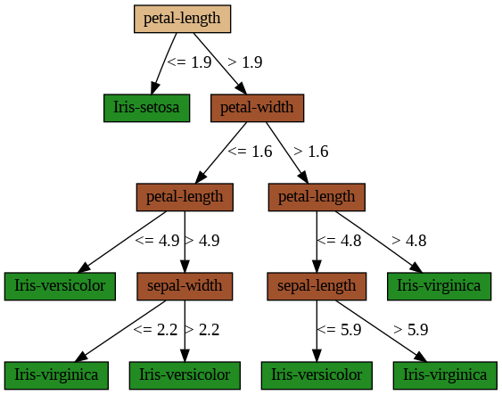
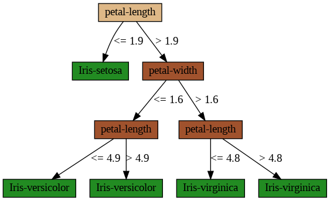
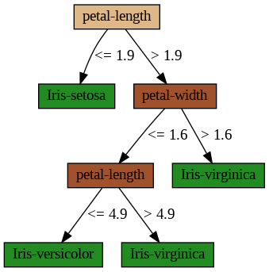

## $${\color{purple} C4.5 \space decision \space tree:}$$
The C4.5 decision tree algorithm is a popular method used in machine
learning for classification tasks. It is an extension of the earlier ID3
algorithm developed by Ross Quinlan. C4.5 constructs a decision tree
based on a set of training data and is known for its ability to handle
both categorical and continuous data, manage missing values, and perform
pruning to avoid overfitting.

### How C4.5 Works:

1.  **Splitting Criterion:** C4.5 uses the concept of information gain ratio (a normalized version of information gain) to determine the
     best attribute to split the data at each node of the tree.

2.  **Handling Continuous Data:** For continuous attributes, C4.5 creates a threshold and splits the data into subsets where values
     are either above or below this threshold.

3.  **Handling Missing Values:** C4.5 can handle missing attribute values by considering the proportion of each class in the subset
     of data where the attribute is not missing.

4.  **Pruning:** C4.5 performs a pruning step after the tree is created to remove branches that may reflect noise or outliers, improving
     the generalization ability of the model.  

### $${\color{red}C4.5 Decision \space Tree \space Algorithm:\}$$

1.  **Calculate Gain Ratio (GR) for each feature and select the best feature**:

    -   For each feature:

        -   Calculate the entropy before the split.

        -   Calculate the entropy after the split for each possible value.

        -   Calculate the Information Gain.

        -   Normalize the Information Gain to get the Gain Ratio.

    -   Select the feature with the highest Gain Ratio.

2.  **Create a node for the best feature**:

    -   This node will represent the decision based on the best feature selected.

3.  **Split the dataset based on the unique values of the best feature**:

    -   Partition the dataset into subsets where each subset contains all the instances with a specific value of the chosen feature.

4.  **Loop to check each unique value in the best feature**:

    -   For each unique value of the chosen feature:

        -   **Create a subset of the dataset based on the unique value**:

            -   Extract all instances that have this unique value for the feature.

        -   **If the labels of all samples in the subset are the same**:

            -   **Create a leaf node**:

                -   This node will have a class label which is the label of the samples.

        -   **Otherwise**:

            -   **Return to the first step**:

                -   Recursively apply the C4.5 algorithm to the subset to build the tree further.  
                  
 ### $${\color{green}Visualization \space of \space Decision \space Tree - Iris \space Dataset:}$$ 

  

      
  
  

 
 **$${\color{green}Tree \space  with \space Pre-pruning:}$$**

 

      
  
  

**$${\color{green}Tree \space with \space Post-pruning:}$$**
 

      
  

